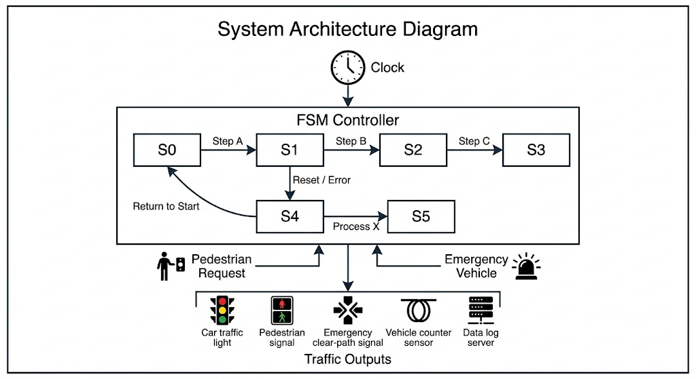
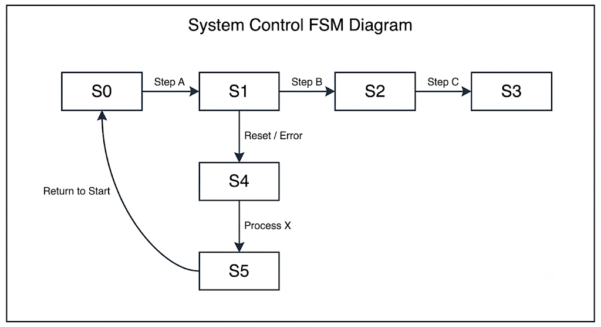
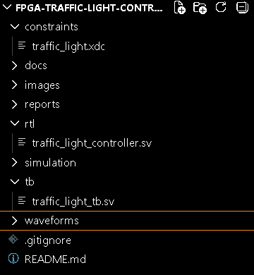
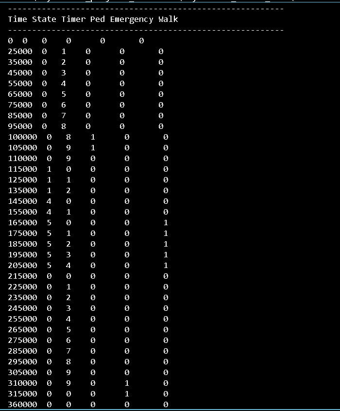
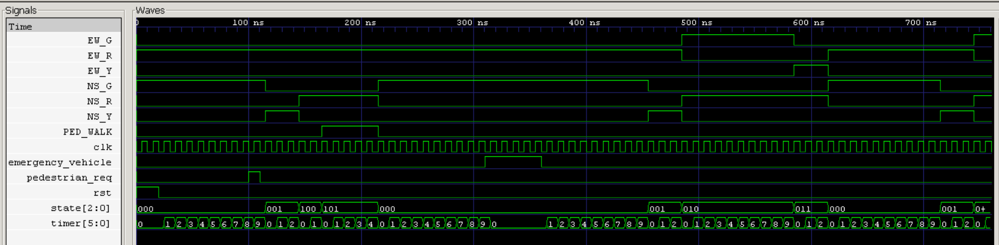
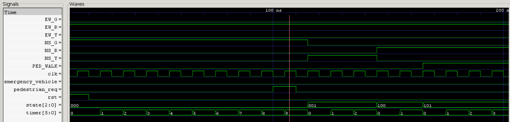
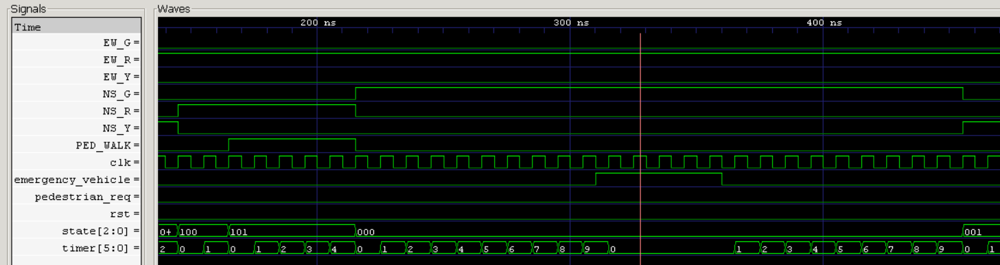
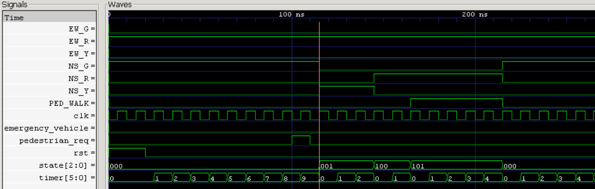

# 🚦 FPGA-Based Traffic Light Controller with Pedestrian Crossing & Emergency Vehicle Priority

## Overview

This project presents an industry-oriented **FPGA-Based Traffic Light Controller** designed using **SystemVerilog** and **Finite State Machine (FSM)** concepts. The controller manages traffic flow at a road intersection while supporting **pedestrian crossing requests** and **emergency vehicle priority override**, making it closer to a real-world smart traffic management system.

The design has been verified through simulation using **Icarus Verilog** and **GTKWave**, and is ready for implementation on FPGA platforms using tools such as **Xilinx Vivado**.

---

## Project Highlights

* Finite State Machine (FSM) Based Design
* North-South / East-West Traffic Control
* Pedestrian Crossing Request Handling
* Emergency Vehicle Priority Override
* All-Red Safety State
* Timer-Based Signal Control
* SystemVerilog RTL Implementation
* Verification using Testbench and GTKWave
* FPGA Deployment Ready
* Industry-Oriented Digital Design Project

---

## Applications

* Smart Traffic Management Systems
* Smart City Infrastructure
* FPGA-Based Embedded Controllers
* Industrial Automation Systems
* Transportation Control Networks
* Real-Time Digital Control Systems

---

## System Architecture

```text
                     +----------------------+
 Clock ------------->|                      |
 Reset ------------->|                      |
 Pedestrian Request->|   FSM Controller     |
 Emergency Vehicle ->|                      |
                     +----------+-----------+
                                |
                                v
                     +----------------------+
                     |     Timer Counter    |
                     +----------+-----------+
                                |
                                v
          +-------------------------------------------+
          | Traffic Light Output Logic                |
          +-------------------------------------------+
                                |
                                v

      NS_R  NS_Y  NS_G   EW_R  EW_Y  EW_G  PED_WALK
```

---

## FSM State Encoding

| State | Binary | Description          |
| ----- | ------ | -------------------- |
| S0    | 000    | North-South Green    |
| S1    | 001    | North-South Yellow   |
| S2    | 010    | East-West Green      |
| S3    | 011    | East-West Yellow     |
| S4    | 100    | All Red Safety State |
| S5    | 101    | Pedestrian Walk      |

---

## FSM Flow

### Normal Traffic Operation

```text
S0 → S1 → S2 → S3 → S0
```

### Pedestrian Request Flow

```text
S0/S2
   ↓
Yellow
   ↓
All Red
   ↓
Pedestrian Walk
   ↓
S0
```

### Emergency Vehicle Priority

```text
Any State
   ↓
NS Green Priority
```

---

## Features Implemented

### Normal Traffic Control

Controls traffic flow between:

* North-South Direction
* East-West Direction

using timer-based state transitions.

### Pedestrian Crossing

When a pedestrian request is detected:

* Current traffic phase completes safely
* Controller enters All-Red State
* Pedestrian Walk Signal is activated
* Traffic resumes automatically

### Emergency Vehicle Priority

When emergency mode is activated:

* Traffic controller immediately prioritizes the emergency route
* Safe signal transition is maintained
* Controller resumes normal operation after emergency clearance

---

## Technologies Used

| Category           | Technology                   |
| ------------------ | ---------------------------- |
| HDL                | SystemVerilog                |
| Design Methodology | FSM Design                   |
| Simulation         | Icarus Verilog               |
| Waveform Analysis  | GTKWave                      |
| FPGA Tool          | Xilinx Vivado                |
| Verification       | Testbench-Based Verification |

---

## Project Structure

```text
FPGA-Traffic-Light-Controller/

├── constraints/
│   └── traffic_light.xdc
│
├── docs/
│   ├── FPGA_Implementation.md
│   ├── FSM_Design.md
│   ├── Project_Overview.md
│   ├── Simulation_Guide.md
│   └── Waveform_Analysis.md
│
├── images/
│   ├── architecture.png
│   ├── emergency_override.png
│   ├── fsm_diagram.png
│   ├── pedestrian_event.png
│   ├── project_structure.png
│   └── timer_verification.png
│
├── reports/
│   └── Project_Report.pdf
│
├── rtl/
│   └── traffic_light_controller.sv
│
├── simulation/
│   └── terminal_simulation.png
│
├── tb/
│   └── traffic_light_tb.sv
│
├── waveforms/
│   └── full_system_waveform.png
│
├── README.md
└── .gitignore
```

---

## Simulation Instructions

### Compile

```bash
iverilog -g2012 -o traffic_sim rtl/traffic_light_controller.sv tb/traffic_light_tb.sv
```

### Run

```bash
vvp traffic_sim
```

### Open Waveform

```bash
gtkwave traffic_light.vcd
```

---

# Project Architecture


# FSM Design


# Project Structure


# Simulation Output


# Full System Verification


# Pedestrian Crossing Verification


# Emergency Vehicle Override


# Timer Verification


---

## Verification Results

The simulation verified:

* Correct FSM State Transitions
* Timer Operation
* Pedestrian Request Handling
* Emergency Vehicle Override
* All-Red Safety State
* Pedestrian Walk Signal Activation
* Safe Traffic Signal Sequencing

---

## Waveform Demonstration

### Full System Verification

* State Transitions
* Timer Counting
* Pedestrian Events
* Emergency Events
* Traffic Outputs

Refer to:

```text
waveforms/full_system_waveform.png
```

---

## FPGA Implementation Flow

1. Create Vivado Project
2. Add RTL Source Files
3. Add Constraint File (.xdc)
4. Run Synthesis
5. Run Implementation
6. Generate Bitstream
7. Program FPGA Device

Traffic signals can be mapped to FPGA LEDs for hardware verification.

---

## Learning Outcomes

* Finite State Machine Design
* RTL Coding using SystemVerilog
* Traffic Control Logic Design
* FPGA Development Flow
* Verification Methodology
* Timing and Waveform Analysis
* Digital System Design Concepts

---

## Future Enhancements

* Adaptive Traffic Timing
* Vehicle Density Sensors
* Smart Intersection Control
* AI-Based Traffic Optimization
* Multi-Junction Traffic Network
* IoT-Based Traffic Monitoring

---

## Author

**Vayunandan Mishra**

Electronics & Communication Engineering (ECE)

Interested in:

* FPGA Design
* VLSI Design
* RTL Design
* Digital Verification
* Embedded Systems
* Hardware Acceleration

---

## License

This project is released for educational and portfolio purposes.
